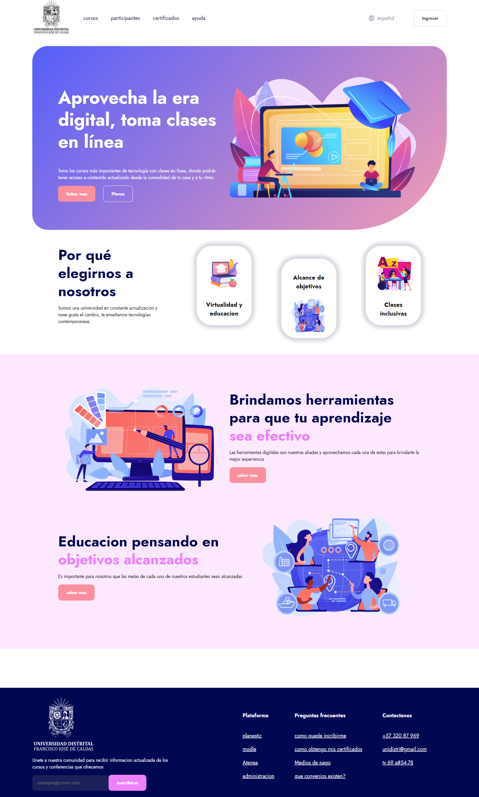

<h1>Taller 9 - jhoan santiago roa lugo</h1>
<h2>Informacion</h2>

Curso: full stack Basico - grupo 1

profesor: Cristian Patiño

<h2>Link de la pagina web</h2>
<a href="https://jhoan101122.github.io/taller-9-fuul-stack/"
alt="link de pagina web">

<h2>punto 1: Link de figma</h2>
<a href="https://www.figma.com/file/git /jhoan-santiago-roa-lugo?type=design&node-id=0%3A1&mode=design&t=OwQCxVGbKWz7XiRS-1">link de figma</a>

<h2>punto 2: Diseño en HTML</h2>

<h2>punto 3: Diseño con CSS</h2>

<h2>punto 4: Titulos</h2>

<h2>punto 5: Parrafo</h2>

<h2>punto 6: Links</h2>

<h2>punto 7 y 8: Navegacion</h2>

<h2>punto 9: Tabla</h2>

